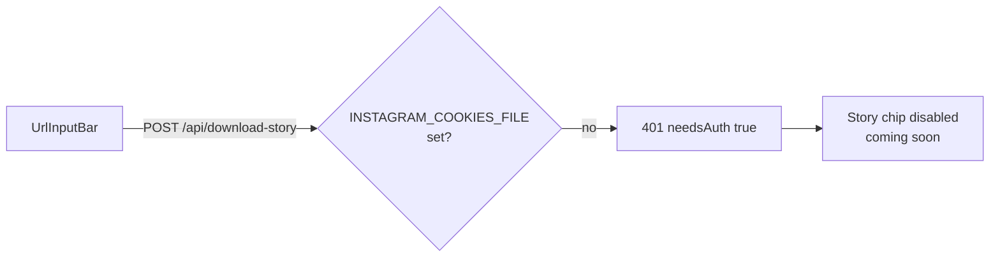

# InstaSave

A web app for downloading Instagram media — Videos, Reels, IGTV, Photos, and Stories — built on Next.js (App Router), React 19, TypeScript strict mode, Tailwind CSS v4, Biome, Playwright, and Sentry. All media types are fetched through Instagram's public GraphQL endpoint; file downloads are proxied through a host-allowlisted CORS bypass. Story downloads are wired but dormant until an Instagram session cookie is provided. The app runs entirely on Vercel — no external binaries or long-running subprocesses required.

## Tech Stack

| Area            | Choice                                        |
| --------------- | --------------------------------------------- |
| Framework       | Next.js 16 (App Router)                        |
| UI runtime      | React 19                                       |
| Language        | TypeScript (strict)                           |
| Components      | base-ui + shadcn                               |
| Styling         | Tailwind CSS v4                                |
| Forms           | react-hook-form + zod                          |
| Media engine    | Instagram GraphQL (video + images)           |
| File proxy      | `/api/image-proxy` (host-allowlisted)        |
| Lint / Format   | Biome 2                                        |
| E2E             | Playwright (Chromium)                          |
| Monitoring      | Sentry (`@sentry/nextjs`)                      |
| Security scan   | Snyk (SARIF → GitHub Code Scanning)            |
| Package manager | pnpm 9                                         |
| Git hooks       | Husky + nano-staged                            |

## Data Flow

### Video / Reel / IGTV

```mermaid
flowchart LR
    A["UrlInputBar"] -->|"POST /api/download"| B["route.ts"]
    B --> C["extractVideoManifest"]
    C --> D["initInstagramSession<br/>fetch LSD token"]
    D --> E["fetchMediaGraphQL<br/>PolarisLoggedOut query"]
    E --> F["video_versions<br/>pick highest-res"]
    F --> G["Response JSON<br/>videos"]
    G --> H["VideoManifestList"]
    H -->|"click Save"| I["GET /api/image-proxy"]
    I --> J["fetch Instagram CDN<br/>host-allowlisted"]
    J --> K["Blob download"]
```



### Photo

```mermaid
flowchart LR
    A["UrlInputBar"] -->|"POST /api/download-image"| B["route.ts"]
    B --> C["extractImageManifest"]
    C --> D["initInstagramSession<br/>fetch LSD token"]
    D --> E["fetchMediaGraphQL<br/>PolarisLoggedOut query"]
    E --> F["image_versions2.candidates<br/>pick highest-res"]
    F --> G["Response JSON<br/>images"]
    G --> H["PhotoManifestList"]
    H -->|"click Save"| I["GET /api/image-proxy"]
    I --> J["fetch Instagram CDN<br/>host-allowlisted"]
    J --> K["Blob download"]
```



### Story (auth-gated, dormant)



## Folder Structure

```
ig-reels-downloader-poc/
├── .github/
│   └── workflows/
│       └── ci.yml                       # Lint, typecheck, E2E, build, Snyk
├── docs/                                # Engineering guidelines
│   ├── 01_COMPONENT-PATTERNS.md
│   ├── 02_FRONTEND-FOLDER-STRUCTURE.md
│   └── 03_TYPESCRIPT-STANDARDS.md
├── src/
│   ├── app/
│   │   ├── api/
│   │   │   ├── download/route.ts        # Video/Reel/IGTV → JSON manifest
│   │   │   ├── download-image/route.ts  # Photo → JSON manifest
│   │   │   ├── download-story/route.ts  # Story → 401 (auth-gated)
│   │   │   └── image-proxy/route.ts     # CORS bypass for Instagram CDN
│   │   ├── components/
│   │   │   ├── MediaDownloader.tsx      # Container, switches on media type
│   │   │   ├── MediaTypeChips.tsx       # Video / Photo / Reels / Story / IGTV
│   │   │   ├── UrlInputBar.tsx          # Shared input + paste + submit
│   │   │   ├── VideoDownloaderForm.tsx
│   │   │   ├── PhotoDownloaderForm.tsx
│   │   │   ├── StoryDownloaderForm.tsx
│   │   │   ├── VideoManifestList.tsx
│   │   │   ├── VideoManifestCard.tsx
│   │   │   ├── PhotoManifestList.tsx
│   │   │   ├── ImageManifestCard.tsx
│   │   │   ├── StoryManifestList.tsx
│   │   │   ├── StoryManifestCard.tsx
│   │   │   ├── TopNavBar.tsx
│   │   │   ├── ValueProposition.tsx
│   │   │   ├── Instructions.tsx
│   │   │   └── SiteFooter.tsx
│   │   ├── globals.css
│   │   ├── layout.tsx
│   │   └── page.tsx                     # Composition only
│   ├── components/
│   │   └── ui/                          # Reusable shadcn / base-ui primitives
│   ├── lib/
│   │   ├── instagram-session.ts         # LSD token + GraphQL fetch
│   │   ├── instagram-image.ts           # Image manifest extraction
│   │   ├── instagram-video.ts           # Video manifest extraction
│   │   ├── validators.ts                # Zod schemas + InstagramMediaType enum
│   │   └── utils.ts                     # cn, formatFileSize
│   ├── shared/
│   │   └── hooks/
│   │       ├── download-types.ts        # FormStatus enum + shared state
│   │       ├── useReelDownload.ts       # Video/Reel/IGTV
│   │       ├── useImageDownload.ts      # Photo
│   │       └── useStoryDownload.ts      # Story
│   ├── sentry.client.config.ts
│   ├── sentry.server.config.ts
│   ├── sentry.edge.config.ts
│   └── instrumentation.ts
├── tests/
│   ├── reel-downloader.spec.ts          # URL validation, paste, chip switching
│   └── smoke.spec.ts
├── biome.json
├── next.config.ts                       # next/image remote patterns for IG CDN
├── package.json
├── playwright.config.ts
└── tsconfig.json                        # @/* → ./src/*
```

## Setup

1. Copy `.env.example` to `.env.local` and fill in the values:

   ```bash
   cp .env.example .env.local
   ```

2. Install dependencies and Playwright browsers:

   ```bash
   pnpm install
   pnpm test:install
   ```

3. Start the dev server:

   ```bash
   pnpm dev
   ```

The app runs at [http://localhost:3000](http://localhost:3000).

### Story downloads

Story downloads require an Instagram session cookie. Without it, the Story chip stays disabled and `/api/download-story` returns `401 { needsAuth: true }`. This feature is not yet implemented.

## Scripts

| Script              | Description                              |
| ------------------- | ---------------------------------------- |
| `pnpm dev`          | Start development server                  |
| `pnpm build`        | Production build                         |
| `pnpm start`        | Start production server                  |
| `pnpm lint`         | Run Biome lint & format checks           |
| `pnpm format`       | Auto-format with Biome                   |
| `pnpm typecheck`    | Run TypeScript type checking (`tsc --noEmit`) |
| `pnpm test`         | Run Playwright E2E tests                 |
| `pnpm test:ui`      | Run Playwright with interactive UI       |
| `pnpm test:install` | Install Playwright Chromium browser      |

## Git Hooks

[Husky](https://typicode.github.io/husky/) manages Git hooks:

- **pre-commit**: runs `nano-staged`, which executes `biome check --staged` on staged files.
- **pre-push**: runs `pnpm typecheck && pnpm test`.

Hooks are installed automatically via the `prepare` script when running `pnpm install`.

## CI (GitHub Actions)

The `.github/workflows/ci.yml` workflow runs on push to `main` and on pull requests:

1. Lint (Biome)
2. Typecheck (`tsc --noEmit`)
3. E2E tests (Playwright, Chromium only)
4. Build (`next build` with Sentry source map upload)

A `snyk` job runs in parallel, scanning dependencies for high-severity vulnerabilities and uploading the results as SARIF to GitHub Code Scanning. It is allowed to continue on error so findings do not block the pipeline.

### Required GitHub Secrets

Configure these in **Settings → Secrets and variables → Actions**:

| Secret                   | Description                            |
| ------------------------ | -------------------------------------- |
| `NEXT_PUBLIC_SENTRY_DSN` | Sentry DSN (client + server)           |
| `SENTRY_AUTH_TOKEN`      | Sentry auth token for source map upload |
| `SENTRY_ORG`             | Sentry organization slug               |
| `SENTRY_PROJECT`         | Sentry project slug                    |
| `SNYK_TOKEN`             | Snyk API token for vulnerability scans |

## Documentation

- [Component Patterns](./docs/01_COMPONENT-PATTERNS.md)
- [Frontend Folder Structure](./docs/02_FRONTEND-FOLDER-STRUCTURE.md)
- [TypeScript Standards](./docs/03_TYPESCRIPT-STANDARDS.md)